# Family Hub — Database ERD & Schema

> Source of truth: the 45 Mongoose models in `backend/models/`.
> The database is **MongoDB (document store)**. The "foreign keys" below are `ObjectId`
> references (`ref:`) resolved with Mongoose `populate()`. Some references use the
> member **email string** (`member_mail`) instead of an ObjectId — these are noted.
>
> **How to view the diagram:** paste the Mermaid block into <https://mermaid.live>,
> or open this file in VS Code with a Mermaid preview extension, or in GitHub.

---

## 1. Entity-Relationship Diagram (Mermaid)

```mermaid
erDiagram
    %% ===== Authentication & Family =====
    FamilyAccount ||--o{ Member : "has"
    FamilyAccount ||--o{ MemberType : "defines"
    MemberType ||--o{ Member : "classifies"

    %% ===== Tasks & Rewards =====
    FamilyAccount ||--o{ TaskCategory : "has"
    FamilyAccount ||--o{ Task : "has"
    TaskCategory ||--o{ Task : "groups"
    Task ||--o{ TaskDetails : "assigned as"
    Member ||--o{ TaskDetails : "assigned to (mail)"

    %% ===== Points wallet =====
    FamilyAccount ||--o{ PointWallet : "has"
    Member ||--o{ PointWallet : "owns (mail)"
    PointWallet ||--o{ PointHistory : "logs"
    FamilyAccount ||--o{ PointHistory : "scopes"
    Task ||--o{ PointHistory : "source (opt)"
    Redeem ||--o{ PointHistory : "source (opt)"

    %% ===== Wishlist & Redeem =====
    FamilyAccount ||--o{ WishlistCategory : "has"
    FamilyAccount ||--o{ Wishlist : "has"
    Member ||--o{ Wishlist : "owns (mail)"
    Wishlist ||--o{ WishlistItem : "contains"
    WishlistCategory ||--o{ WishlistItem : "groups"
    FamilyAccount ||--o{ Redeem : "scopes"
    Member ||--o{ Redeem : "requests (mail)"
    WishlistItem ||--o{ Redeem : "redeemed as (opt)"

    %% ===== Money wallet & conversion =====
    FamilyAccount ||--o{ MemberWallet : "has"
    Member ||--o{ MemberWallet : "owns (mail)"
    MemberWallet ||--o{ WalletTransaction : "logs"
    FamilyAccount ||--o{ WalletTransaction : "scopes"
    FamilyAccount ||--o{ ConversionRate : "configures"
    FamilyAccount ||--o{ BalanceWalletDetail : "audits"
    MemberWallet ||--o{ BalanceWalletDetail : "audited by"
    PointWallet ||--o{ BalanceWalletDetail : "audited by"

    %% ===== Budget =====
    FamilyAccount ||--o{ PeriodBudget : "has"
    PeriodBudget ||--o{ BudgetAllocation : "splits into"
    InventoryCategory ||--o{ BudgetAllocation : "categorizes"
    PeriodBudget ||--o{ MemberAllowance : "funds"
    Member ||--o{ MemberAllowance : "receives (mail)"
    FamilyAccount ||--o{ Expense : "has"
    PeriodBudget ||--o{ Expense : "charged to (opt)"
    InventoryCategory ||--o{ Expense : "categorizes (opt)"
    Member ||--o{ Expense : "recorded by (mail)"
    Redeem ||--o{ Expense : "linked (opt)"
    MemberWallet ||--o{ Expense : "linked (opt)"
    MemberAllowance ||--o{ Expense : "linked (opt)"
    FutureEvent ||--o{ Expense : "linked (opt)"
    FamilyAccount ||--o{ FutureEvent : "plans"

    %% ===== Inventory =====
    FamilyAccount ||--o{ Inventory : "has"
    Inventory ||--o{ InventoryItem : "stores"
    InventoryCategory ||--o{ InventoryItem : "categorizes"
    Unit ||--o{ InventoryItem : "measured by"
    Receipt ||--o{ InventoryItem : "sourced from (opt)"
    InventoryItem ||--o{ InventoryAlert : "triggers"
    FamilyAccount ||--o{ InventoryAlert : "scopes"
    InventoryCategory ||--o{ InventoryCategory : "parent of"
    FamilyAccount ||--o{ ItemCategory : "has (legacy)"

    %% ===== Food Hub =====
    FamilyAccount ||--o{ Recipe : "has"
    Member ||--o{ Recipe : "author (mail)"
    Recipe ||--o{ RecipeIngredient : "needs"
    Unit ||--o{ RecipeIngredient : "measured by"
    Recipe ||--o{ RecipeStep : "has"
    FamilyAccount ||--o{ Meal : "logs"
    Recipe ||--o{ Meal : "based on (opt)"
    Meal ||--o{ MealItem : "consumes"
    InventoryItem ||--o{ MealItem : "deducts"
    Unit ||--o{ MealItem : "measured by"
    FamilyAccount ||--o{ MealSuggestion : "gets"
    Recipe ||--o{ MealSuggestion : "suggests"
    FamilyAccount ||--o{ Leftover : "has"
    Member ||--o{ Leftover : "owner (mail)"
    InventoryCategory ||--o{ Leftover : "categorizes (opt)"
    Unit ||--o{ Leftover : "measured by"
    Meal ||--o{ Leftover : "from (opt)"
    FamilyAccount ||--o{ LeftoverCategory : "has"
    FamilyAccount ||--o{ GroceryList : "has"
    GroceryList ||--o{ GroceryItem : "contains"

    %% ===== Receipts =====
    FamilyAccount ||--o{ Receipt : "has"
    Member ||--o{ Receipt : "recorded by (mail)"

    %% ===== Location =====
    FamilyAccount ||--o{ LocationShare : "has"
    Member ||--o{ LocationShare : "shares (mail)"
    FamilyAccount ||--o{ LocationHistory : "logs"
    FamilyAccount ||--o{ LocationAlert : "raises"
    FamilyAccount ||--o{ LocationPermission : "scopes"
    FamilyAccount ||--o{ SharedLocation : "scopes"

    %% ===== Planning AI =====
    FamilyAccount ||--o{ PlanningConversation : "has"
    Member ||--o{ PlanningConversation : "chats"

    FamilyAccount {
        ObjectId _id PK
        string mail UK
        string password "hashed, hidden"
        string Title
        boolean isActivated
        boolean active
        string passwordResetToken
        date passwordResetExpires
    }
    Member {
        ObjectId _id PK
        string username
        string mail
        string password "hashed, hidden, nullable"
        boolean isFirstLogin
        ObjectId family_id FK
        ObjectId member_type_id FK
        date birth_date
    }
    MemberType {
        ObjectId _id PK
        string type
        ObjectId family_id FK
        string_array Permissions "unused"
    }
    TaskCategory {
        ObjectId _id PK
        string title
        string description
        ObjectId family_id FK
    }
    Task {
        ObjectId _id PK
        string title
        string description
        boolean is_mandatory
        string created_by "member mail"
        string reward_type "points|money|both"
        number money_reward
        boolean paid_to_wallet
        ObjectId category_id FK
        ObjectId family_id FK
    }
    TaskDetails {
        ObjectId _id PK
        ObjectId task_id FK
        string member_mail "FK by mail"
        number assigned_points
        number penalty_points
        date deadline
        string assigned_by "mail"
        boolean assignment_approved
        number priority
        string status "assigned|in_progress|completed|late|approved|rejected"
        date completed_at
        string approved_by "mail"
    }
    PointWallet {
        ObjectId _id PK
        string member_mail "FK by mail"
        ObjectId family_id FK
        number total_points
        date last_update
    }
    PointHistory {
        ObjectId _id PK
        ObjectId wallet_id FK
        string member_mail
        ObjectId family_id FK
        number points_amount "+/-"
        string reason_type "task_completion|penalty|redeem|bonus|adjustment|manual_grant|conversion"
        ObjectId task_id FK
        ObjectId redeem_id FK
        string granted_by "mail"
    }
    WishlistCategory {
        ObjectId _id PK
        string title
        string description
        ObjectId family_id FK
    }
    Wishlist {
        ObjectId _id PK
        string member_mail "FK by mail"
        ObjectId family_id FK
        string title
    }
    WishlistItem {
        ObjectId _id PK
        ObjectId wishlist_id FK
        ObjectId category_id FK
        string item_name
        number required_points
        string assigned_by "mail"
        number priority
        string status "active|redeemed|removed"
    }
    Redeem {
        ObjectId _id PK
        ObjectId family_id FK
        ObjectId member_id FK
        string requester "mail"
        string approver "mail"
        string status "pending|parent_approved|child_accepted|rejected|cancelled"
        string request_details
        number point_deduction
        string payment_method "points|money|mixed"
        number points_used
        number money_used
        ObjectId wishlist_item_id FK
        ObjectId linked_expense_id FK
        ObjectId linked_event_id FK
    }
    MemberWallet {
        ObjectId _id PK
        ObjectId family_id FK
        string member_mail
        number balance
        date last_update
    }
    WalletTransaction {
        ObjectId _id PK
        ObjectId family_id FK
        string member_mail
        ObjectId member_wallet_id FK
        number amount
        string transaction_type "deposit|withdrawal"
        string conversion_type "none|money_to_points|points_to_money"
        number converted_amount
        number conversion_rate
        ObjectId linked_point_transaction_id FK
    }
    ConversionRate {
        ObjectId _id PK
        ObjectId family_id FK
        number money_to_points_rate
        number points_to_money_rate
        boolean is_active
        ObjectId created_by FK
    }
    BalanceWalletDetail {
        ObjectId _id PK
        ObjectId family_id FK
        string member_mail
        string wallet_scope "money_wallet|points_wallet|shared_budget|personal_budget"
        string change_type "credit|debit"
        string source_type "allowance|task_reward|conversion|redeem|expense|manual_adjustment|event_contribution|budget_withdrawal"
        number amount
        number previous_balance
        number new_balance
        ObjectId member_wallet_id FK
        ObjectId point_wallet_id FK
    }
    PeriodBudget {
        ObjectId _id PK
        ObjectId family_id FK
        string title
        string period_type "weekly|monthly|yearly|custom"
        date start_date
        date end_date
        number total_amount
        number spent_amount
        string currency
        number threshold_percentage
        number emergency_fund_percentage
        number emergency_fund_spent
        boolean is_active
        ObjectId created_by FK
    }
    BudgetAllocation {
        ObjectId _id PK
        ObjectId family_id FK
        ObjectId period_budget_id FK
        ObjectId inventory_category_id FK
        number allocated_amount
        number spent_amount
        number threshold_percentage
        boolean is_active
    }
    MemberAllowance {
        ObjectId _id PK
        ObjectId family_id FK
        ObjectId period_budget_id FK
        ObjectId member_id FK
        string member_mail
        string period_type
        date start_date
        date end_date
        number money_amount
        number spent_amount
        ObjectId linked_point_wallet_id FK
    }
    Expense {
        ObjectId _id PK
        ObjectId family_id FK
        ObjectId member_id FK
        string member_mail
        string category
        string title
        number amount
        date expense_date
        string expense_source "budget|member_wallet|redeem_reward|personal_budget"
        ObjectId budget_id FK
        ObjectId budget_category_id FK
        ObjectId linked_member_allowance_id FK
        ObjectId linked_redeem_id FK
        ObjectId linked_member_wallet_id FK
        ObjectId linked_event_id FK
        string request_status "pending|approved|rejected|null"
        string expense_scope "shared|personal"
    }
    FutureEvent {
        ObjectId _id PK
        ObjectId family_id FK
        string title
        date event_date
        number estimated_cost
        number total_contributed_money
        number total_contributed_points
        string funding_source "budget|member_contributions|points_redeem"
        number required_points
        string created_by "mail"
    }
    Inventory {
        ObjectId _id PK
        ObjectId family_id FK
        string title
        string type "Food|Electronics|Cleaning|Personal Care|Other"
    }
    InventoryItem {
        ObjectId _id PK
        ObjectId inventory_id FK
        ObjectId item_category FK
        string item_name
        number quantity
        ObjectId unit_id FK
        number threshold_quantity
        date purchase_date
        date expiry_date
        ObjectId receipt_id FK
        date last_notified_at
    }
    InventoryCategory {
        ObjectId _id PK
        string title
        ObjectId parent_category_id FK
        string description
    }
    InventoryAlert {
        ObjectId _id PK
        ObjectId inventory_item_id FK
        ObjectId family_id FK
        string alert_type "low_stock|expiring_soon|expired"
        string alert_message
        boolean is_read
    }
    ItemCategory {
        ObjectId _id PK
        string title
        ObjectId parent_category_id FK
        string description
        ObjectId family_id FK
    }
    Unit {
        ObjectId _id PK
        string unit_name UK
        string unit_type "weight|volume|count"
    }
    Recipe {
        ObjectId _id PK
        string member_mail "FK by mail"
        string recipe_name
        string category "Breakfast|Lunch|Dinner|Dessert|Snack|Appetizer|Main Course|Side Dish|Beverage|Other"
        number serving_size
        string description
        number prep_time
        number cook_time
        ObjectId family_id FK
    }
    RecipeIngredient {
        ObjectId _id PK
        ObjectId recipe_id FK
        string ingredient_name
        number quantity
        ObjectId unit_id FK
        string notes
    }
    RecipeStep {
        ObjectId _id PK
        ObjectId recipe_id FK
        number step_number
        string instruction
        number duration
    }
    Meal {
        ObjectId _id PK
        ObjectId family_id FK
        string meal_name
        date meal_date
        string meal_type "Breakfast|Lunch|Dinner|Snack"
        ObjectId recipe_id FK
        string created_by "mail"
    }
    MealItem {
        ObjectId _id PK
        ObjectId meal_id FK
        ObjectId inventory_item_id FK
        ObjectId unit_id FK
        number quantity_used
    }
    MealSuggestion {
        ObjectId _id PK
        ObjectId family_id FK
        ObjectId recipe_id FK
        string meal_type "Breakfast|Lunch|Dinner|Snack|Any"
        number match_percentage
        array missing_ingredients
        array available_ingredients
        boolean uses_expiring_items
        boolean uses_leftovers
    }
    Leftover {
        ObjectId _id PK
        string member_mail "FK by mail"
        ObjectId family_id FK
        string item_name
        ObjectId category_id FK
        ObjectId unit_id FK
        number quantity
        ObjectId meal_id FK
        date date_added
        date expiry_date
    }
    LeftoverCategory {
        ObjectId _id PK
        string title
        string description
        ObjectId family_id FK
    }
    GroceryList {
        ObjectId _id PK
        ObjectId family_id FK
        string title
        string created_by "mail"
        string color
    }
    GroceryItem {
        ObjectId _id PK
        ObjectId list_id FK
        string item_name
        number quantity
        string unit
        string category
        boolean is_checked
        string added_by "mail"
    }
    Receipt {
        ObjectId _id PK
        ObjectId family_id FK
        string member_mail "FK by mail"
        number total_amount
        date purchase_date
        string store_name
        string receipt_photo_url
        array items
        number subtotal
        number taxes
    }
    LocationShare {
        ObjectId _id PK
        string member_mail "FK by mail"
        ObjectId family_id FK
        number latitude
        number longitude
        date last_updated
        boolean is_sharing_enabled
    }
    LocationHistory {
        ObjectId _id PK
        string member_mail
        ObjectId family_id FK
        number latitude
        number longitude
        date recorded_at "TTL 30d"
    }
    LocationAlert {
        ObjectId _id PK
        string member_mail
        ObjectId family_id FK
        string alert_type "geofence_enter|geofence_exit|sos|low_battery|sharing_disabled|sharing_enabled|custom"
        string message
        number latitude
        number longitude
        boolean is_read
    }
    LocationPermission {
        ObjectId _id PK
        string requester_mail
        string target_mail
        ObjectId family_id FK
        string permission_status "pending|approved|denied"
        date requested_at
    }
    SharedLocation {
        ObjectId _id PK
        string sender_mail
        string receiver_mail
        ObjectId family_id FK
        string location_name
        number latitude
        number longitude
        string address
        date expires_at "TTL"
        boolean is_viewed
    }
    PlanningConversation {
        ObjectId _id PK
        ObjectId family_id FK
        ObjectId member_id FK
        array messages "{role,content,timestamp}"
    }
```

> **Legend:** `||--o{` = one-to-many (one parent, zero-or-more children). `PK` = primary
> key (`_id`). `FK` = foreign-key reference. `UK` = unique. "(mail)" / "FK by mail" means
> the link is stored as the member's **email string**, not an ObjectId. "(opt)" = optional
> / nullable relationship. `_id`, `createdAt`, `updatedAt` exist on every timestamped
> collection and are omitted from the tables below for brevity.

---

## 2. Schema Tables (by module)

> Type = Mongoose/BSON type. Ref = referenced collection. R = Required.

### 2.1 Authentication & Family

**FamilyAccount** — the family root account (also holds the shared password).

| Field | Type | Ref / Notes | R |
|-------|------|-------------|---|
| mail | String | unique, validated email | ✔ |
| password | String | bcrypt-hashed (cost 12), `select:false` | ✔ |
| Title | String | family name | ✔ |
| isActivated | Boolean | default `false` | |
| active | Boolean | default `true` | |
| passwordResetToken | String | set during reset flow | |
| passwordResetExpires | Date | 60-min expiry | |

**Member** — a person in a family. Unique `(username, family_id)` and `(mail, family_id)`.

| Field | Type | Ref / Notes | R |
|-------|------|-------------|---|
| username | String | | ✔ |
| mail | String | validated email | ✔ |
| password | String | bcrypt-hashed, `select:false`, `null` until set | |
| isFirstLogin | Boolean | default `true` | |
| family_id | ObjectId | → FamilyAccount | ✔ |
| member_type_id | ObjectId | → MemberType | ✔ |
| birth_date | Date | used by birthday reminders | ✔ |

**MemberType** — role within a family. Unique `(type, family_id)`.

| Field | Type | Ref / Notes | R |
|-------|------|-------------|---|
| type | String | e.g. "Parent", "Child" | ✔ |
| family_id | ObjectId | → FamilyAccount | ✔ |
| Permissions | [String] | reserved, currently unused | |

### 2.2 Tasks & Rewards

**TaskCategory** — unique `(title, family_id)`.

| Field | Type | Ref / Notes | R |
|-------|------|-------------|---|
| title | String | | ✔ |
| description | String | | |
| family_id | ObjectId | → FamilyAccount | ✔ |

**Task** — a reusable chore template.

| Field | Type | Ref / Notes | R |
|-------|------|-------------|---|
| title | String | | ✔ |
| description | String | | |
| is_mandatory | Boolean | default `false` | |
| created_by | String | member email | ✔ |
| reward_type | String | `points` \| `money` \| `both` | |
| money_reward | Number | default 0 | |
| paid_to_wallet | Boolean | default `false` | |
| category_id | ObjectId | → TaskCategory | ✔ |
| family_id | ObjectId | → FamilyAccount | ✔ |

**TaskDetails** (collection `taskdetails`) — one assignment of a task to a member. *No `family_id`* — scope via `task_id → Task.family_id`.

| Field | Type | Ref / Notes | R |
|-------|------|-------------|---|
| task_id | ObjectId | → Task | ✔ |
| member_mail | String | assignee email | ✔ |
| assigned_points | Number | | ✔ |
| penalty_points | Number | default 0 | |
| deadline | Date | | ✔ |
| assigned_by | String | member email | ✔ |
| assignment_approved | Boolean | default `false` | |
| assignment_approved_by | String | member email | |
| priority | Number | default 0 | |
| status | String | `assigned`\|`in_progress`\|`completed`\|`late`\|`approved`\|`rejected` | ✔ |
| completed_at | Date | | |
| approved_by | String | member email | |
| approved_at | Date | | |
| notes | String | | |

### 2.3 Points Wallet

**PointWallet** — one per member per family. Unique `(member_mail, family_id)`.

| Field | Type | Ref / Notes | R |
|-------|------|-------------|---|
| member_mail | String | | ✔ |
| family_id | ObjectId | → FamilyAccount | ✔ |
| total_points | Number | default 0 | |
| last_update | Date | | |

**PointHistory** (collection `pointhistories`) — every points change.

| Field | Type | Ref / Notes | R |
|-------|------|-------------|---|
| wallet_id | ObjectId | → PointWallet | ✔ |
| member_mail | String | | ✔ |
| family_id | ObjectId | → FamilyAccount | ✔ |
| points_amount | Number | positive or negative | ✔ |
| reason_type | String | `task_completion`\|`penalty`\|`redeem`\|`bonus`\|`adjustment`\|`manual_grant`\|`conversion` | ✔ |
| task_id | ObjectId | → Task (optional) | |
| redeem_id | ObjectId | → Redeem (optional) | |
| granted_by | String | member email | ✔ |
| description | String | | |

### 2.4 Money Wallet & Conversion

**MemberWallet** — money balance, one per member per family. Unique `(member_mail, family_id)`.

| Field | Type | Ref / Notes | R |
|-------|------|-------------|---|
| family_id | ObjectId | → FamilyAccount | ✔ |
| member_mail | String | | ✔ |
| balance | Number | default 0, min 0 | |
| last_update | Date | | |

**WalletTransaction** — deposits/withdrawals/conversions on a money wallet.

| Field | Type | Ref / Notes | R |
|-------|------|-------------|---|
| family_id | ObjectId | → FamilyAccount | ✔ |
| member_mail | String | | ✔ |
| member_wallet_id | ObjectId | → MemberWallet | ✔ |
| amount | Number | | ✔ |
| transaction_type | String | `deposit` \| `withdrawal` | |
| description | String | | |
| transaction_date | Date | | |
| conversion_type | String | `none`\|`money_to_points`\|`points_to_money` | |
| converted_amount | Number | | |
| conversion_rate | Number | | |
| linked_point_transaction_id | ObjectId | → PointHistory (optional) | |

**ConversionRate** — money↔points rates; one active per family.

| Field | Type | Ref / Notes | R |
|-------|------|-------------|---|
| family_id | ObjectId | → FamilyAccount | ✔ |
| money_to_points_rate | Number | default 10 | |
| points_to_money_rate | Number | default 0.05 | |
| is_active | Boolean | default `true` | |
| created_by | ObjectId | → Member | |

**BalanceWalletDetail** — full audit log of every balance change (money or points).

| Field | Type | Ref / Notes | R |
|-------|------|-------------|---|
| family_id | ObjectId | → FamilyAccount | ✔ |
| member_id | ObjectId | → Member | |
| member_mail | String | | ✔ |
| wallet_scope | String | `money_wallet`\|`points_wallet`\|`shared_budget`\|`personal_budget` | |
| change_type | String | `credit` \| `debit` | ✔ |
| source_type | String | `allowance`\|`task_reward`\|`conversion`\|`redeem`\|`expense`\|`manual_adjustment`\|`event_contribution`\|`budget_withdrawal` | ✔ |
| amount | Number | min 0 | ✔ |
| previous_balance | Number | | |
| new_balance | Number | | |
| member_wallet_id | ObjectId | → MemberWallet | |
| point_wallet_id | ObjectId | → PointWallet | |
| linked_expense_id / linked_wallet_transaction_id / linked_point_history_id / linked_redeem_id / linked_task_history_id | ObjectId | optional cross-links | |
| budget_id | ObjectId | → Budget | |
| budget_category_id | ObjectId | → InventoryCategory | |

### 2.5 Wishlist & Redeem

**WishlistCategory** — unique `(title, family_id)`.

| Field | Type | Ref / Notes | R |
|-------|------|-------------|---|
| title | String | | ✔ |
| description | String | | |
| family_id | ObjectId | → FamilyAccount | ✔ |

**Wishlist** — one per member per family. Unique `(member_mail, family_id)`.

| Field | Type | Ref / Notes | R |
|-------|------|-------------|---|
| member_mail | String | | ✔ |
| family_id | ObjectId | → FamilyAccount | ✔ |
| title | String | default "My Wishlist" | |

**WishlistItem**

| Field | Type | Ref / Notes | R |
|-------|------|-------------|---|
| wishlist_id | ObjectId | → Wishlist | ✔ |
| category_id | ObjectId | → WishlistCategory | ✔ |
| item_name | String | | ✔ |
| required_points | Number | | ✔ |
| assigned_by | String | member email | ✔ |
| description | String | | |
| priority | Number | default 0 | |
| status | String | `active`\|`redeemed`\|`removed` | |

**Redeem** — a redemption request and its lifecycle.

| Field | Type | Ref / Notes | R |
|-------|------|-------------|---|
| family_id | ObjectId | → FamilyAccount | |
| member_id | ObjectId | → Member | |
| requester | String | member email | ✔ |
| approver | String | member email | |
| status | String | `pending`\|`parent_approved`\|`child_accepted`\|`rejected`\|`cancelled` | ✔ |
| request_details | String | | ✔ |
| point_deduction | Number | | ✔ |
| payment_method | String | `points`\|`money`\|`mixed` | |
| points_used / money_used | Number | | |
| points_deducted / money_deducted | Boolean | | |
| wishlist_item_id | ObjectId | → WishlistItem | |
| linked_expense_id | ObjectId | → Expense | |
| linked_wallet_transaction_id | ObjectId | → WalletTransaction | |
| linked_event_id | ObjectId | → FutureEvent | |
| rejection_reason | String | | |

### 2.6 Budget

**PeriodBudget** — the active budget design. Virtuals: `emergency_fund_amount`, `emergency_fund_remaining`.

| Field | Type | Ref / Notes | R |
|-------|------|-------------|---|
| family_id | ObjectId | → FamilyAccount | ✔ |
| title | String | | ✔ |
| period_type | String | `weekly`\|`monthly`\|`yearly`\|`custom` | ✔ |
| start_date / end_date | Date | | ✔ |
| total_amount | Number | | ✔ |
| spent_amount | Number | default 0 | |
| currency | String | default "EGP" | |
| threshold_percentage | Number | default 15 | |
| emergency_fund_percentage | Number | default 10 | |
| emergency_fund_spent | Number | default 0 | |
| is_active | Boolean | default `true` | |
| created_by | ObjectId | → Member | |

**BudgetAllocation** — per-category split of a period budget. Unique `(period_budget_id, inventory_category_id)`.

| Field | Type | Ref / Notes | R |
|-------|------|-------------|---|
| family_id | ObjectId | → FamilyAccount | ✔ |
| period_budget_id | ObjectId | → PeriodBudget | ✔ |
| inventory_category_id | ObjectId | → InventoryCategory | ✔ |
| allocated_amount | Number | | ✔ |
| spent_amount | Number | default 0 | |
| threshold_percentage | Number | default 15 | |
| is_active | Boolean | default `true` | |

**MemberAllowance** — per-child allowance from a budget. Virtual: `remaining_amount`.

| Field | Type | Ref / Notes | R |
|-------|------|-------------|---|
| family_id | ObjectId | → FamilyAccount | ✔ |
| period_budget_id | ObjectId | → PeriodBudget | |
| member_id | ObjectId | → Member | |
| member_mail | String | | ✔ |
| period_type | String | `weekly`\|`monthly`\|`yearly`\|`custom` | |
| start_date / end_date | Date | | |
| money_amount | Number | default 0 | |
| spent_amount | Number | default 0 | |
| linked_point_wallet_id | ObjectId | → PointWallet | |

**Expense**

| Field | Type | Ref / Notes | R |
|-------|------|-------------|---|
| family_id | ObjectId | → FamilyAccount | ✔ |
| member_id | ObjectId | → Member | |
| member_mail | String | who recorded it | |
| category | String | plain text, **not** a ref | |
| title | String | | ✔ |
| amount | Number | min 0 | ✔ |
| description | String | | |
| expense_date | Date | (use this, not `date`) | |
| notes | String | | |
| expense_source | String | `budget`\|`member_wallet`\|`redeem_reward`\|`personal_budget` | |
| budget_id | ObjectId | → PeriodBudget (legacy `ref:'Budget'`) | |
| budget_category_id | ObjectId | → InventoryCategory | |
| linked_member_allowance_id | ObjectId | → MemberAllowance | |
| is_finalized | Boolean | | |
| linked_redeem_id | ObjectId | → Redeem | |
| linked_member_wallet_id | ObjectId | → MemberWallet | |
| linked_event_id | ObjectId | → FutureEvent | |
| request_status | String | `pending`\|`approved`\|`rejected`\|`null` (null = direct expense) | |
| expense_scope | String | `shared` \| `personal` | |

**FutureEvent** — savings goal / planned event. Embeds `members_contributing[]` (member_id, amount/points promised & paid).

| Field | Type | Ref / Notes | R |
|-------|------|-------------|---|
| family_id | ObjectId | → FamilyAccount | ✔ |
| title | String | | ✔ |
| description | String | | |
| event_date | Date | | ✔ |
| estimated_cost | Number | | |
| total_contributed_money | Number | | |
| total_contributed_points | Number | | |
| funding_source | String | `budget`\|`member_contributions`\|`points_redeem` | |
| required_points | Number | | |
| linked_rewards | [ObjectId] | → Redeem | |
| auto_created_reward_items | [ObjectId] | → WishlistItem | |
| created_by | String | member email | |

**Budget** *(legacy — superseded by PeriodBudget; kept for compatibility)* — unique `(family_id, category_name)`.

| Field | Type | Ref / Notes | R |
|-------|------|-------------|---|
| family_id | ObjectId | → FamilyAccount | ✔ |
| category_name | String | | ✔ |
| budget_amount | Number | | |
| spent_amount | Number | | |
| is_active | Boolean | | |

### 2.7 Inventory

**Inventory** — a storage container.

| Field | Type | Ref / Notes | R |
|-------|------|-------------|---|
| family_id | ObjectId | → FamilyAccount | ✔ |
| title | String | | ✔ |
| type | String | `Food`\|`Electronics`\|`Cleaning`\|`Personal Care`\|`Other` | |

**InventoryItem** — *no direct `family_id`* (scope via `inventory_id → Inventory.family_id`).

| Field | Type | Ref / Notes | R |
|-------|------|-------------|---|
| inventory_id | ObjectId | → Inventory | ✔ |
| item_category | ObjectId | → InventoryCategory | ✔ |
| item_name | String | | ✔ |
| quantity | Number | min 0 | ✔ |
| unit_id | ObjectId | → Unit | ✔ |
| threshold_quantity | Number | default 1 | |
| purchase_date | Date | | |
| expiry_date | Date | | |
| receipt_id | ObjectId | → Receipt | |
| last_notified_at | Date | | |

**InventoryCategory** — self-referencing tree. Field is `title` (not `name`).

| Field | Type | Ref / Notes | R |
|-------|------|-------------|---|
| title | String | | ✔ |
| parent_category_id | ObjectId | → InventoryCategory (self) | |
| description | String | | |

**InventoryAlert**

| Field | Type | Ref / Notes | R |
|-------|------|-------------|---|
| inventory_item_id | ObjectId | → InventoryItem | ✔ |
| family_id | ObjectId | → FamilyAccount | ✔ |
| alert_type | String | `low_stock`\|`expiring_soon`\|`expired` | ✔ |
| alert_message | String | | ✔ |
| is_read | Boolean | default `false` | |

**ItemCategory** *(legacy — use InventoryCategory)* — unique `(title, family_id)`. Fields: `title`, `parent_category_id` (self), `description`, `family_id`.

**Unit** — `unit_name` (unique), `unit_type` (`weight`\|`volume`\|`count`).

### 2.8 Food Hub

**Recipe**

| Field | Type | Ref / Notes | R |
|-------|------|-------------|---|
| member_mail | String | author email | ✔ |
| recipe_name | String | | ✔ |
| category | String | `Breakfast`…`Other` (10 values) | ✔ |
| serving_size | Number | min 1 | ✔ |
| description | String | | |
| prep_time / cook_time | Number | minutes | |
| family_id | ObjectId | → FamilyAccount | ✔ |

**RecipeIngredient** — `recipe_id`→Recipe, `ingredient_name`, `quantity`, `unit_id`→Unit, `notes`. *No family_id.*

**RecipeStep** — `recipe_id`→Recipe, `step_number`, `instruction`, `duration`. Unique `(recipe_id, step_number)`.

**Meal**

| Field | Type | Ref / Notes | R |
|-------|------|-------------|---|
| family_id | ObjectId | → FamilyAccount | ✔ |
| meal_name | String | | ✔ |
| meal_date | Date | | ✔ |
| meal_type | String | `Breakfast`\|`Lunch`\|`Dinner`\|`Snack` | ✔ |
| recipe_id | ObjectId | → Recipe (optional) | |
| created_by | String | member email | ✔ |

**MealItem** — `meal_id`→Meal, `inventory_item_id`→InventoryItem, `unit_id`→Unit, `quantity_used`.

**MealSuggestion** — `family_id`→FamilyAccount, `recipe_id`→Recipe, `meal_type` (incl. `Any`), `match_percentage` (0–100), `missing_ingredients[]`, `available_ingredients[]`, `uses_expiring_items`, `uses_leftovers`.

**Leftover** — note `category_id` refs **InventoryCategory** (not LeftoverCategory).

| Field | Type | Ref / Notes | R |
|-------|------|-------------|---|
| member_mail | String | owner email | ✔ |
| family_id | ObjectId | → FamilyAccount | ✔ |
| item_name | String | | ✔ |
| category_id | ObjectId | → InventoryCategory | |
| unit_id | ObjectId | → Unit | ✔ |
| quantity | Number | | ✔ |
| meal_id | ObjectId | → Meal (optional) | |
| date_added | Date | | |
| expiry_date | Date | | ✔ |

**LeftoverCategory** — `title`, `description`, `family_id`. Unique `(title, family_id)`.

**GroceryList** — `family_id`→FamilyAccount, `title`, `created_by` (mail), `color`.

**GroceryItem** — `list_id`→GroceryList, `item_name`, `quantity`, `unit`, `category`, `is_checked`, `added_by` (mail). *No direct family_id.*

### 2.9 Receipts

**Receipt** — embeds `items[]` = `{ name, quantity, unit, price }`.

| Field | Type | Ref / Notes | R |
|-------|------|-------------|---|
| family_id | ObjectId | → FamilyAccount | ✔ |
| member_mail | String | recorder email | ✔ |
| total_amount | Number | min 0 | ✔ |
| purchase_date | Date | | ✔ |
| store_name | String | | |
| receipt_photo_url | String | | |
| notes | String | | |
| items | [Object] | `{name, quantity, unit, price}` | |
| subtotal / taxes | Number | | |

### 2.10 Location

**LocationShare** — live location. Unique `(member_mail, family_id)`. Fields: `member_mail`, `family_id`, `latitude`, `longitude`, `last_updated`, `is_sharing_enabled`.

**LocationHistory** — `member_mail`, `family_id`, `latitude`, `longitude`, `recorded_at` (TTL: auto-deletes after 30 days).

**LocationAlert** — `member_mail`, `family_id`, `alert_type` (`geofence_enter`\|`geofence_exit`\|`sos`\|`low_battery`\|`sharing_disabled`\|`sharing_enabled`\|`custom`), `message`, `latitude`, `longitude`, `is_read`.

**LocationPermission** — `requester_mail`, `target_mail`, `family_id`, `permission_status` (`pending`\|`approved`\|`denied`), `requested_at`. Unique `(requester_mail, target_mail, family_id)`.

**SharedLocation** — one-time snapshot. `sender_mail`, `receiver_mail`, `family_id`, `location_name`, `latitude`, `longitude`, `address`, `message`, `expires_at` (TTL), `is_viewed`.

### 2.11 Planning AI

**PlanningConversation** — `family_id`→FamilyAccount, `member_id`→Member, `messages[]` = embedded `{ role: user|assistant, content, timestamp }`.

---

## 3. Changes vs. your old ERD

**Added (existed in code, missing from old ERD):** MemberWallet, WalletTransaction,
BalanceWalletDetail, ConversionRate, PeriodBudget, BudgetAllocation, MemberAllowance,
PlanningConversation, GroceryList, GroceryItem, LocationPermission, SharedLocation.

**Removed (in old ERD, no matching collection):** Reward_expense_link, Food_expense_link,
Budget Alert, Future_event_reminder. (These links are handled by `linked_*` fields directly
on Expense / Redeem instead of separate join tables.)

**Renamed / corrected:** old "Budget" → **PeriodBudget** (the legacy `Budget` model is kept
but deprecated); old "Location" → **LocationShare**; member links use the **email string**
`member_mail`, not `family_mail`. The `permissions/functions` attribute on MemberType is
present in the schema (`Permissions: [String]`) but unused in the app.
